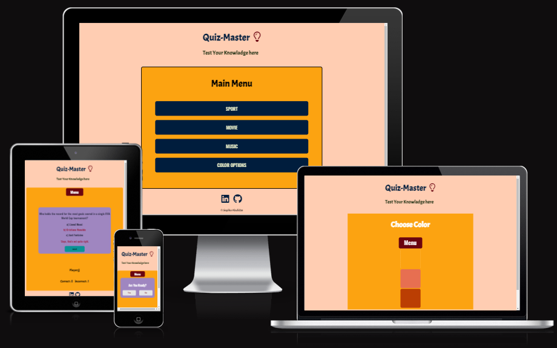
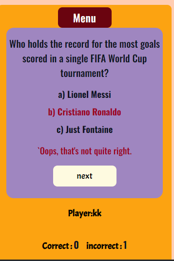
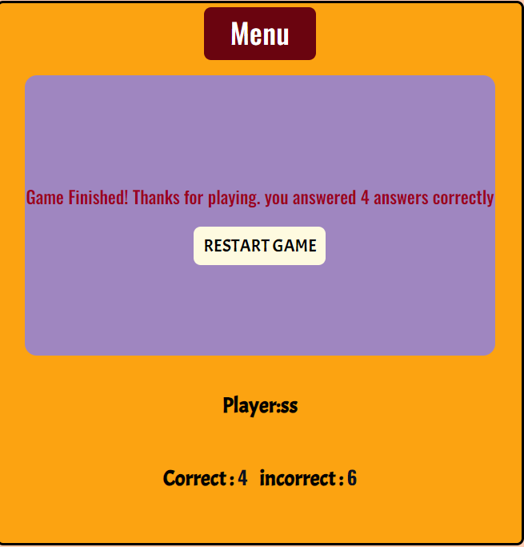
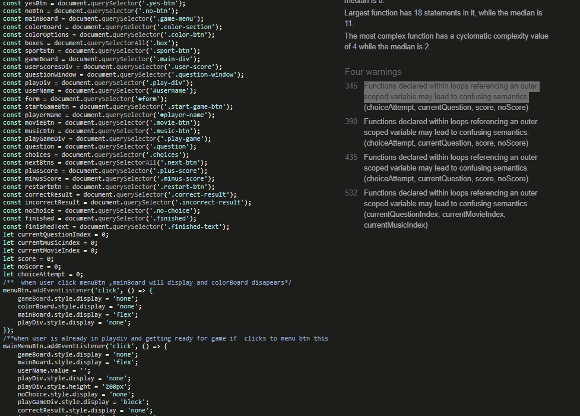
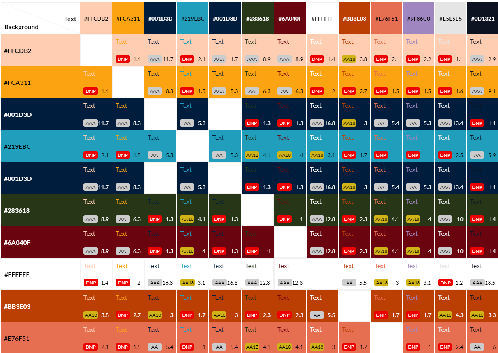

# **Quiz-Master**

## introduction

Welcome to Quiz-Master. I decide to create this game for peope who loves online games. This easy game will chalenge user's knowladge in three categories :sport,music and movie.

## Planning Stage

## Target Audience

- Gamers
- Sport,Music and Movie Fans.
- Users who are looking to expand their knowledge base in a fun way.
- Users who are looking for quick and enjoyable way to spend time.

## Site Aim

- The goal of the site is to provide a challenging quiz to entertain online users.
- Entertain and educate its target audience in sport, music and movie categories.
- Create enjoyable and interactive platform for users to test their knowledge and have fun.

## User

- The site's user wants to play an online quiz to test general/specific knowledge such as sports/movies/movies.
- User should navigate the page to find what he/she requires easily.
- Users aim to have fun, relax, and engage in an enjoyable gaming experience.

## Features

### Main Menu

Fully responsive Main menu allow users to easyly navigate thorugh main page, and choose category which he/she wants to play or just change the Color-theme.User can Choose a category with simply click on category name.

## Question-Window

When a user selects one of the categories, a small window will appear, asking the user if they are ready to start the game. If the user clicks 'No,' they will return to the main menu. If the user clicks 'Yes,' a new window will open, prompting them to create a username.

## Username

After clicking the 'Yes' button on the question window, another window will open, prompting users to create a username. If a user does not create a username, they will not be allowed to start the game.

### Game

- After creating a username and pressing 'Enter' or clicking the 'Start Game' button, the game will commence. The questions presented will depend on the category chosen by the user.
- it has score tracking system, chich counts correct and incorrect answers.
- when user creates username its username displays on screen .
- incorrect and corretc answers have relevant feedback text .
- when user clicks next btn, next question will display ..
- when user clicks to Menu btn, it will return to Main Menu.

  

### finished

After the game finishes, a 'Finished' message will appear, indicating how many questions the user answered correctly. Additionally, there is a 'Restart' button that allows the user to begin the game again.

### choose color

When users click the 'Choose Color' button on the main menu, they are allowed to select a color theme from a choice of three different themes.

### Footer

The quiz game's footer includes links to my GitHub and LinkedIn profiles, as well as a copyright notice.

## **Testing**

- I checked this project using DevTools' device toolbar and confirmed that it looks responsive on all screen types.
- all sections are readeble and easy to understand.
- The site works in different browsers:Firefox,Chrome,Safari.
- I Tested that github and linkdin links works on footer page.
- I confirm that all Features works without problem.
- I checked that score tracking system works correctly.
- I've tested each button to ensure they perform their designated tasks with precision and excellence.

## Bugs

### Fixed Bugs

- The primary challenge I encountered during the development of this project was obtaining relevant questions for each category. Initially, I faced the issue of questions from one category appearing mixed with questions from other categories. To address this, I implemented a solution by setting the 'current question index' to 10, ensuring that only questions from the selected category are displayed. This adjustment helped maintain a consistent and category-specific quiz experience.For instance, when a user selects the 'Movie' category, in the 'getMovieQuestions' function, the question indexes for 'Sports' and 'Music' are both set to 10, while the 'Movie' question index is set to 0. This configuration ensures that only questions from the 'Movie' category are presented.

### Unfixed Bugs

- No unfixed bugs.

## **Validator Testing**

- HTML-No errors were found when passing through the official ( W3C )validator.
- CSS-No errors were found when passing through the official (Jigsaw) validator.
- Js JSHint, the JavaScript validator, showed me an error mentioning that functions declared within loops referencing an outer scoped variable may lead to confusing semantics. I have checked it several times, and my game logic works just fine without any issues. As I have no time left to work on it, I will leave it for now and come back later for refactoring
  
  
  

### accessibility

- I confirm that colors and fonts are checked through lighthouse testing and they are easy to read and accessible.
   

### Design

### Typography

- I used Acme and Oswald - for the project.

### Color Scheme

- In my quiz game, the main theme prominently features bright and cheerful colors, symbolizing fun and entertainment
- I create color palette using [Cooloers](https://coolors.co)
- I used contrast-grid to check contrast between colors.
  

## **Deployment**

The site was deployed to GitHub pages. The steps to deploy are as follows:

1. In the GitHub repository, go to the Settings tab.(which locates at top right of the repository)
2. scroll down to the github pages section.
3. we select the branch in the source section.(main) and save it.
4. In few moments the page will be automatically refreshed and will generate a URL .

- The live link can be found here - <https://tamariam.github.io/Quiz-Master/>

## credits

### General Reference

- I receive random questions, answer choices, and their correct answers from ChatGPT in these three categories.
- I relied on W3school and MDN for general references throughout the project.
- I have a feeling that my JavaScript code is quite basic, and there may be more advanced ways to write the same code as I currently have in my JavaScript file. However, due to time constraints, I'm sending the current version now. I plan to revisit and refactor the code later.

### **Content**

- The icons in the footer were taken from [fontawasome](https://fontawesome.com/.)
- fonts imported from - [Google fonts](https://fonts.google.com/)
